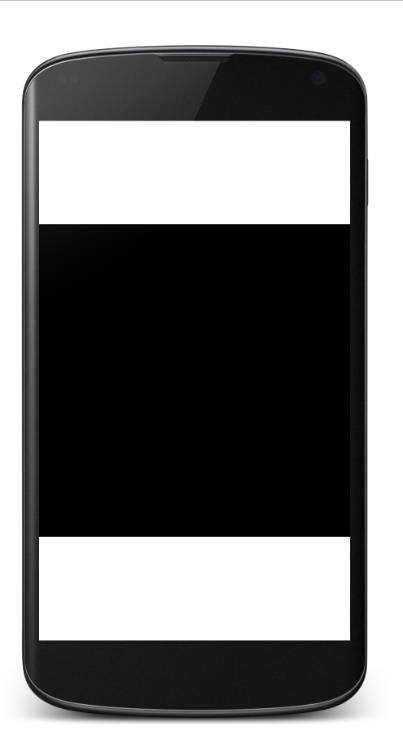
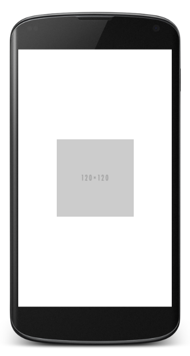

# AspectRatioLayout

## Install

Write folloing lines into your build.gradle

    repositories {
        maven { url 'http://dl.bintray.com/mattak/maven' }
    }
    dependencies {
        compile 'me.mattak:aspect-ratio-layout:0.1.0'
    }

## Usage

Show FrameLayout (1:1 aspect, 50% of parent width size)

```xml
<?xml version="1.0" encoding="utf-8"?>
<LinearLayout xmlns:android="http://schemas.android.com/apk/res/android"
    xmlns:aspect="http://schemas.android.com/apk/res-auto"
    android:layout_width="match_parent"
    android:layout_height="match_parent"
    android:gravity="center"
    android:orientation="vertical">

    <me.mattak.aspect_ratio_layout.FrameLayout
        android:layout_width="match_parent"
        android:layout_height="match_parent"
        android:background="@android:color/black"
        aspect:aspect_height="1"
        aspect:aspect_width="1"
        />

</LinearLayout>
```



Show Image button (10:3 aspect, 50% of parent width size).

```xml
<?xml version="1.0" encoding="utf-8"?>
<LinearLayout xmlns:android="http://schemas.android.com/apk/res/android"
    xmlns:aspect="http://schemas.android.com/apk/res-auto"
    android:layout_width="match_parent"
    android:layout_height="match_parent"
    android:gravity="center"
    android:orientation="vertical">

    <me.mattak.aspect_ratio_layout.ImageButton
        android:layout_width="match_parent"
        android:layout_height="match_parent"
        android:background="@null"
        android:scaleType="fitCenter"
        android:src="@drawable/s120x120"
        aspect:aspect_height="3"
        aspect:aspect_width="10"
        aspect:relative_height="0.5"
        aspect:relative_width="0.5" />

</LinearLayout>
```



Also supports basic views.

- LinearLayout
- RelativeLayout
- FrameLayout
- ImageView
- ImageButton

More details please see the example project layouts.
